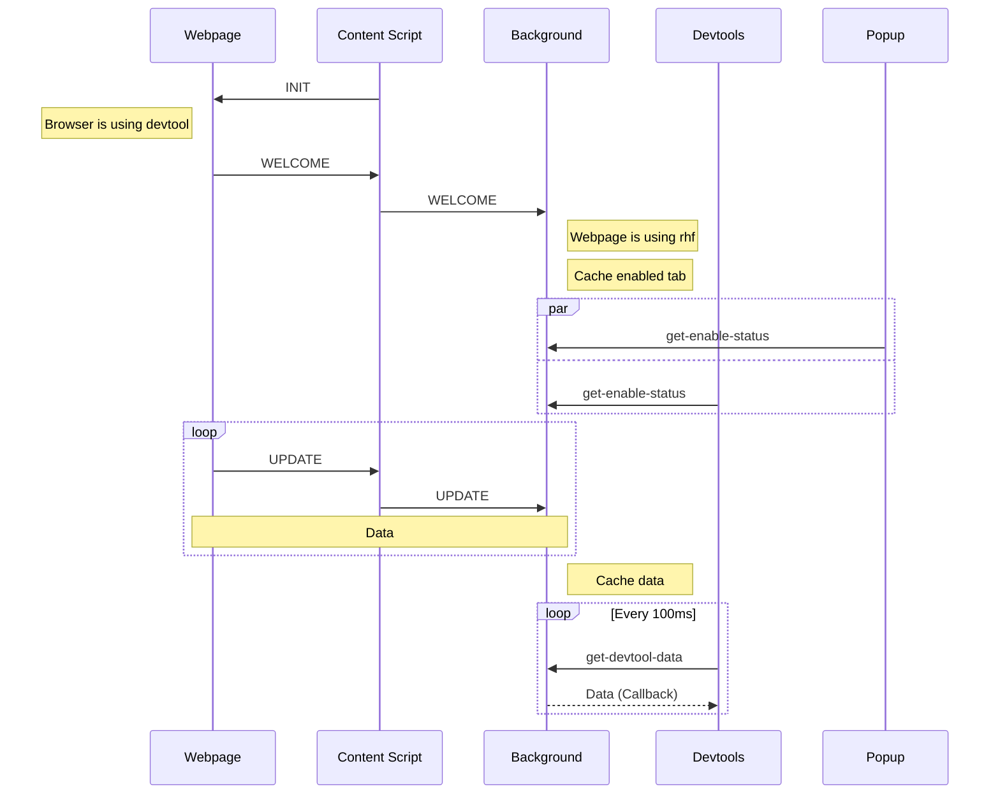

<div align="center">
        <a href="https://react-hook-form.com" title="React Hook Form - Simple React forms validation">
            
        </a>
</div>

## Development

### Install

> **Note**
> use [pnpm](https://pnpm.io/) only

```bash
# extension
pnpm install
# example website
cd example
pnpm install
```

### Start

1. Start example website

```bash
cd example
pnpm run dev
```

2. Start extension in development mode

```bash
pnpm run dev
```

3. Open Chrome and navigate to `chrome://extensions`

4. Enable **Developer mode**

5. Click **Load unpacked** button and select `/dist`

### Messaging Flow


