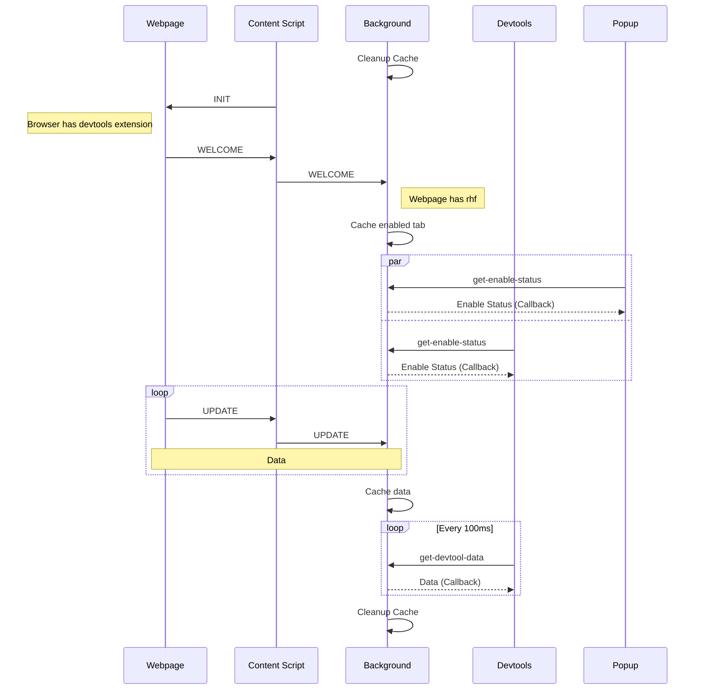

<div align="center">
        <a href="https://react-hook-form.com" title="React Hook Form - Simple React forms validation">
            
            
        </a>
</div>

## Requirement

- [react-hook-form](https://github.com/react-hook-form/react-hook-form) >= `7.33.1`
- [@hookform/devtools](https://github.com/react-hook-form/devtools) >= `4.2.0`

## Usage

1. Install extension in [Chrome Web Store]()  
   _Or [build it yourself](#production) / download the [release](https://github.com/react-hook-form/devtools-extension/releases) file (then goto [Development Run **third step**](#run))_
2. Install [devtools](https://github.com/react-hook-form/devtools) in your project

```bash
npm install @hookform/devtools -D
```

3. Add `<Devtool control={control} />` in your code  
   _This won't show devtools component anymore! Just for extension detect your form_
4. Enjoy!

## Development

### Install

> **Note**
> use [pnpm](https://pnpm.io/) only

```bash
pnpm install
```

### Run

1. Run [example webpage](https://github.com/react-hook-form/devtools/tree/master/example)

2. Run extension in development mode

```bash
pnpm run dev
```

3. Open Chrome and navigate to `chrome://extensions`

4. Enable **Developer mode**

5. Click **Load unpacked** button and select `/dist`

### Messaging Flow



## Production

1. (Optional) Update package and manifest version

```bash
pnpm run update-version -- <version>
```

2. Build

```
pnpm run build
```

3. Production files can be found in `/dist`
